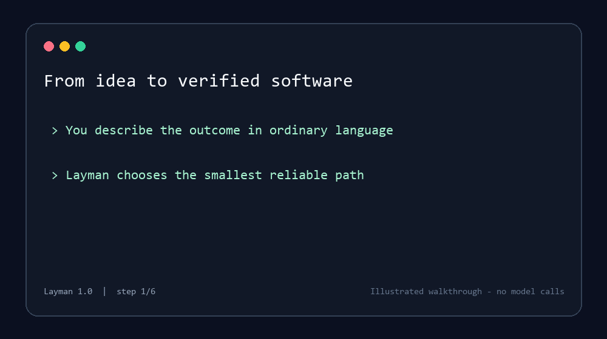

# Layman

**Govern Codex work from intent to evidence-reported result, while measuring and bounding avoidable waste.**

Layman is an evidence-first efficiency governor and execution layer for Codex. It helps beginners understand what to do next and asks Codex to report verification evidence while using the lowest predicted sufficient model effort, enforced tool/process limits, and explicit context/output targets. A successful subprocess alone is not proof that the requested result was verified. Quality-adjusted efficiency remains Experimental until fresh holdouts pass.

[中文说明](README.zh-CN.md) · [Installation](docs/INSTALL.md) · [Architecture](docs/ARCHITECTURE.md) · [Product direction](docs/PRODUCT_DIRECTION_2026-08-12.md) · [Security](docs/SECURITY.md) · [Benchmarks](docs/BENCHMARKS.md) · [Release status](docs/V3_RELEASE_CHECKLIST.md)



## One outcome, four entry points

| Entry point | What the user gets |
|---|---|
| `$layman` | Idea-to-result guidance or execution in plain language |
| `$layman-status` | Evidence-based project stage and the single best next task |
| `$layman-auto` | One unchanged task executed through the easiest reliable Plus route |
| `$layman-router` | Setup, diagnosis, recovery, and explanation for API routing |

Layman composes only the modules needed for the task: context selection, workflow, model routing, safety, tool limits/output targets, and verification guidance. A project is never called release-ready merely because test or CI files exist.

## Plus and API modes

| Capability | ChatGPT login | OpenAI API key |
|---|---:|---:|
| Understand project progress | Yes | Yes |
| Turn an idea into a scoped outcome | Yes | Yes |
| One-task automatic Codex execution | Yes, Experimental | Requires ChatGPT login |
| Context, compaction, file/tool limits, and final-output target | Yes, Experimental | For `model="auto"`: exact-text dedup opt-in and hard output cap only |
| Transparent Responses `model="auto"` routing | No | Yes, Beta |
| Local usage and fallback dashboard | Demo only | Yes |

A ChatGPT subscription does not include API billing. Layman never retries a Plus task through an API key and never presents subscription calibration as measured API invoice savings.

## Install

Windows PowerShell:

```powershell
irm https://raw.githubusercontent.com/Drippinblood333/layman/main/install.ps1 | iex
```

macOS or Linux:

```bash
curl -fsSL https://raw.githubusercontent.com/Drippinblood333/layman/main/install.sh | sh
```

The standalone installer does not require Python. Until a GitHub release with verified artifacts is published, contributors should use the [source installation](docs/INSTALL.md#source-installation); the one-line commands above intentionally have no installable target yet.

## First use

In Codex, ask in ordinary language:

```text
Use $layman to turn my meal-tracking app idea into the smallest working version.
Use $layman-status to explain how far this project has progressed.
Use $layman-auto to implement the next task and verify it.
```

The equivalent CLI accepts the clipboard in these examples, or standard input when `--clipboard` is omitted, so task text need not be placed in command history:

```powershell
layman status
layman plan --clipboard
layman run --dry-run --clipboard
layman run --clipboard
```

API users can preview every Codex configuration change before applying it:

```powershell
layman setup --mode api
layman codex enable --dry-run
layman codex enable --apply
layman start
```

`layman uninstall` removes the Layman plugin and local marketplace, then restores Layman-managed Codex settings. Local usage data and backups remain unless `--purge-data` is explicitly supplied. Purging is refused unless Codex references are removed, the data directory carries a Layman ownership marker, Layman created that directory, and every remaining entry is on the managed-path manifest.

## How optimization works

- **Understand:** inspect bounded repository structure without retaining file contents and distinguish evidence from proof.
- **Select:** choose only the relevant workflow and context modules.
- **Route:** select fast, balanced, or deep model effort with a deep floor for high-risk work.
- **Execute:** use an ephemeral Plus task or the compatible local Responses API route. Layman Auto blocks destructive local execution by default; the API proxy does not inspect or control downstream tool side effects.
- **Verify:** instruct Codex to run the smallest meaningful test or manual check and report the evidence; callers must inspect that evidence before treating the result as verified.
- **Explain:** return outcome, verification, remaining risk, and one next step instead of full logs.

API context deduplication remains opt-in with `metadata.layman_context_mode="safe"`. It removes only exact old prose duplicates and preserves the current user message, system/developer instructions, code blocks, and tool content. Telemetry excludes prompts, code, tool arguments, API keys, and answer text.

### GPT-5.6 stable-prefix caching (opt-in)

GPT-5.6 cache writes cost money, so Layman does not guess what is stable or enable explicit caching globally. For a repeated API workload, put the shared prefix first, mark its final `input_text`, `input_image`, or `input_file` block, and supply a non-secret key. Layman removes its own control metadata before forwarding the request, adds the 30-minute explicit policy, and reports cache reads/writes in the local dashboard.

```json
{
  "model": "auto",
  "metadata": {
    "layman_prompt_cache": "explicit",
    "layman_prompt_cache_key": "docs-v1"
  },
  "input": [{
    "role": "user",
    "content": [
      {"type": "input_text", "text": "Repeated project instructions", "prompt_cache_breakpoint": {"mode": "explicit"}},
      {"type": "input_text", "text": "The current request"}
    ]
  }]
}
```

Use this only after a representative benchmark shows repeated prefixes and net savings. Ordinary one-off tasks keep normal implicit caching.

## Relationship to other open-source projects

| Project | Primary optimization layer | Layman 1.0 approach |
|---|---|---|
| Caveman | Visible answer compression | Concise outcome/verification/risk output target |
| RTK | Shell and tool output compression | Tool-output budgets; external adapter planned instead of vendoring Rust |
| Spec Kit | Specification-driven workflow | Smallest-outcome and acceptance-criteria workflow selection |
| Superpowers | Composable development skills | Progressive, task-specific skill loading |
| Claude Code Router | Provider and model routing | Codex-first Plus and Responses routing with safety floors |

Layman does not vendor code from these projects in 1.0. It combines compatible capabilities through its own control layer, keeping future adapters isolated and license-auditable. See [architecture](docs/ARCHITECTURE.md) and [third-party notices](THIRD_PARTY_NOTICES.md).

## Honest validation status

- The full local unit and integration suite passes; the release checklist records the dated evidence.
- The deterministic routing matrix contains 300 cases, including the high-risk deep floor.
- The historical 2026-07-16 Plus calibration completed 36/36 calls without execution errors or retained answer text; the current release candidate requires a fresh fingerprinted run.
- The 30-pair token benchmark passed hidden validation 30/30 versus Direct's 29/30, but Layman used 19.54% more total tokens at the paired median and read more files.
- Token optimization therefore remains Experimental. Layman claims no fixed savings percentage.
- API routing remains Beta until a release-grade live API benchmark exists.

See the [Plus calibration](docs/PLUS_CALIBRATION_V1.0.0.md), [negative token result](docs/TOKEN_OPTIMIZATION_2026-07-16.md), [release gates](docs/RELEASE.md), [recovery guide](docs/RECOVERY.md), and [contributing guide](CONTRIBUTING.md). Licensed under [MIT](LICENSE).
